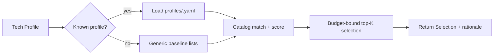

# 07 — Payload Intelligence Architecture

## 1. Core Principle

VulnaX-Pro **does not generate payloads**. It maintains an indexed catalog of
existing, trusted resources and **selects the optimal subset** for each target
based on detected technology. This reduces scan time and false positives while
maximizing relevant coverage.

## 2. Resource Sources (read-only, synced)

- **SecLists** — wordlists (discovery, fuzzing, sensitive files, params).
- **Nuclei Templates** — by tag/tech/severity.
- **ProjectDiscovery resources** — chaos data, default configs.
- **Technology-specific dictionaries** — CMS/framework paths.
- **Framework-specific wordlists** — Laravel, WordPress, etc.

Synced via `python main.py tools update` into `wordlists/` and `templates/nuclei/`.

## 3. Components

```
payload_intelligence/
├── catalog.py     # builds a searchable index of all available resources
├── selector.py    # tech-profile → ranked resource selection
├── profiles/      # per-technology resource maps (yaml)
└── rules.yaml     # selection rules + scoring weights
```

### 3.1 Catalog (`catalog.py`)
Walks `wordlists/` and `templates/nuclei/`, indexing each resource with metadata:
`{path, kind, tags, tech, size, severity?, line_count}`. Built once, cached. Lets
the selector answer "give me the best content-discovery list for Laravel" fast.

### 3.2 Selector (`selector.py`)
Input: an asset's **tech profile** (from TechnologyDetectionEngine) +
the requesting capability (content discovery / template scan / param fuzz).
Output: a ranked, size-bounded list of resources.

```python
def select(self, profile: TechProfile, purpose: Purpose) -> Selection:
    candidates = self.catalog.match(tech=profile.techs, tags=purpose.tags)
    scored = [(r, self._score(r, profile, purpose)) for r in candidates]
    chosen = topk_until_budget(sorted(scored), budget=purpose.budget)
    return Selection(resources=chosen, rationale=...)
```

Scoring factors (`rules.yaml`): tech match strength, framework/CMS specificity,
severity relevance, list quality/precision, size penalty (smaller targeted lists
preferred over giant generic ones), historical hit-rate.

## 4. Technology → Resource Mapping (examples)

`profiles/laravel.yaml`
```yaml
tech: laravel
content_discovery:
  - seclists/Discovery/Web-Content/Laravel.fuzz.txt
  - custom/laravel-paths.txt          # .env, telescope, horizon, debugbar
nuclei_tags: [laravel, php, debug]
sensitive_files: [.env, storage/logs/laravel.log, telescope/requests]
```

`profiles/wordpress.yaml`
```yaml
tech: wordpress
content_discovery:
  - seclists/Discovery/Web-Content/CMS/wordpress.fuzz.txt
nuclei_tags: [wordpress, wp-plugin, wp-theme, cve]
sensitive_files: [wp-config.php.bak, xmlrpc.php, wp-json/wp/v2/users]
```

`profiles/graphql.yaml`
```yaml
tech: graphql
nuclei_tags: [graphql]
actions: [introspection_query, field_suggestion, batching_check]
wordlists: [seclists/Discovery/Web-Content/graphql.txt]
```

`profiles/spa_react.yaml`
```yaml
tech: react
strategy: spa                          # bias crawler to JS analysis over dir-brute
js_focus: true
content_discovery:
  - seclists/Discovery/Web-Content/spa-endpoints.txt
nuclei_tags: [exposure, js]
```

## 5. Selection Triggers per Engine

| Engine | Uses PayloadSelector for |
|--------|--------------------------|
| DeepCrawler | content-discovery wordlists per tech; SPA vs classic strategy |
| ConfigAssessment | sensitive-files lists per tech |
| ApiDiscovery | API/GraphQL wordlists & actions |
| VulnCorrelation | **Nuclei template tag filter** → only run relevant templates |

The Nuclei tag pre-filter is the biggest performance lever: instead of running the
entire template set, only templates matching detected tech/tags execute.

## 6. Decision Flow



## 7. Guardrails

- **Never generate** payloads/exploits — selection only.
- Budget caps prevent runaway scans (max lines per purpose per host).
- Every selection records a rationale → shown in reports for explainability.
- Unknown tech → conservative generic baseline (no blind giant lists).
- All resources read-only; integrity-checked on sync.

## 8. Extensibility

- New tech support = add `profiles/<tech>.yaml` (no code).
- Tune behavior via `rules.yaml` weights.
- Catalog auto-indexes any new wordlist/template dropped into the synced folders.
