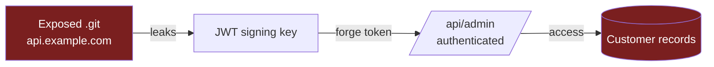

# 09 — Attack Path & Attack Surface Architecture

## 1. Two-Stage Synthesis

```
AttackSurfaceGraphEngine  →  builds the property graph of everything
        ↓
AttackPathEngine          →  overlays findings, searches for chains, narrates
```

## 2. The Attack Surface Graph

A directed property graph (`networkx.MultiDiGraph`) where:

**Node types:** Asset, Host, Port, Service, Technology, Endpoint, Api, AuthSurface,
JsAsset, CloudResource, Finding, CVE.

**Edge types (relationships):**
```
Asset    --resolves_to-->   Host
Host     --exposes-->       Port
Port     --runs-->          Service
Asset    --uses-->          Technology
Technology --vulnerable_to-> CVE
Asset    --serves-->        Endpoint
Endpoint --requires-->      AuthSurface
Endpoint --is-->            Api
JsAsset  --reveals-->       Endpoint
Endpoint --has_finding-->   Finding
Finding  --references-->    CVE
Asset    --linked_to-->     Asset            (trust / same-org)
```

**Node properties** include exposure flags (public/internal, auth-required),
criticality, and risk. **Computed metrics:** degree & betweenness centrality
(pivot importance), exposure score, blast radius.

### Exposure Maps
Projections of the graph answering: "what is reachable without auth?", "which
assets host the most services/findings?", "where do findings cluster?". Rendered in
the Attack Surface report.

## 3. Attack Path Engine

### 3.1 Inputs
Surface graph + findings (with severity/confidence) + auth surfaces + risk + CVE
exploitability (KEV/EPSS).

### 3.2 Entry Points & Targets
- **Entry points:** publicly reachable, unauthenticated, or finding-bearing nodes
  (exposed services, misconfigs, leaked secrets, unauth endpoints).
- **Targets:** high-value nodes (auth/identity systems, data stores, admin
  surfaces, cloud resources, internal pivots).

### 3.3 Path Search
Capability-rule-driven traversal: each edge transition is gated by a rule that
states what an attacker must have to traverse it and what they gain.

```yaml
# path rules (excerpt)
- from: Finding[type=secret_leak]
  to:   AuthSurface[kind=jwt]
  gain: valid_credential
  requires: []
- from: AuthSurface[gain=valid_credential]
  to:   Api[auth_required=true]
  gain: authenticated_access
- from: Finding[type=exposed_git]
  to:   CloudResource
  gain: source_code -> cloud_keys
```

Search = bounded best-first traversal from entries to targets, accumulating
capabilities, retaining **top-K** paths. Path length & branching are capped for
performance.

### 3.4 Path Types Produced
- **Privilege Escalation** — low-priv access → admin/root.
- **Authentication Abuse** — credential/session/JWT/OAuth weaknesses → access.
- **Data Exposure** — exposure → sensitive data reachability.
- **Misconfiguration Chains** — several individually-minor misconfigs → impact.

### 3.5 Scoring
```
path_likelihood = ∏(step_confidence) × edge_feasibility
path_impact     = max(target_criticality, finding_severity along path)
path_risk       = normalize(path_likelihood × impact × exploitability_boost)
```
Findings that participate in high-risk paths get a **chain boost** in
RiskScoringEngine — this is how individually-medium findings surface as critical.

### 3.6 Narratives
`narrative.py` turns a path into prose for reports:
> "An exposed `.git` directory on `api.example.com` leaks source code containing a
> hardcoded JWT signing key. Using it, an attacker forges an admin token and
> reaches the authenticated `/api/admin` surface, exposing customer records."

Each narrative cites evidence refs for every step (explainable, auditable).

## 4. Outputs

`AttackPath` records (see `06_DATA_MODELS.md`) + step diagrams + narratives, fed to
RiskScoring and Reporting. The Attack Path report ranks paths by `path_risk`.

## 5. Performance & Extensibility

- Graph built in a single pass; kept in memory, serialized to artifacts.
- Search bounded (max depth, max branching, top-K) to stay fast on large surfaces.
- New transitions = add capability rules in yaml (no code).
- New node/edge types register via the graph schema.

## 6. Example Mermaid (rendered in reports)


