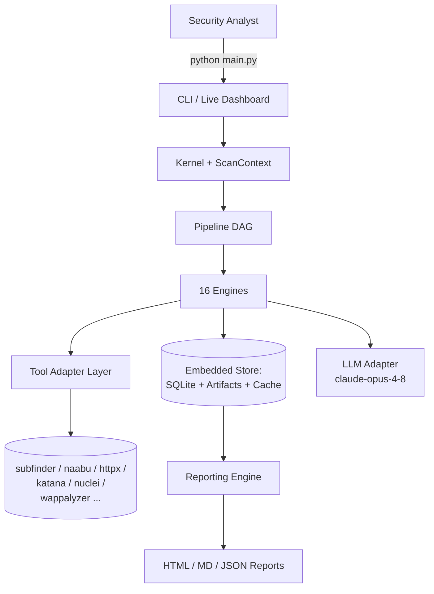
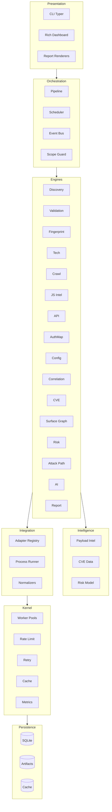
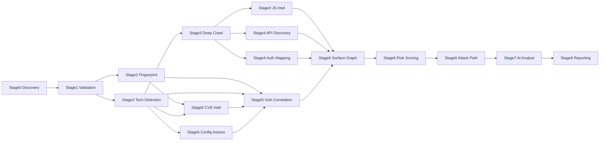
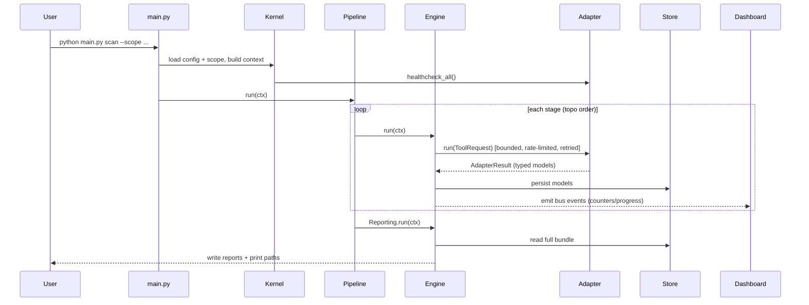
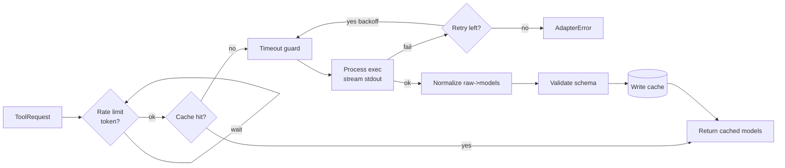
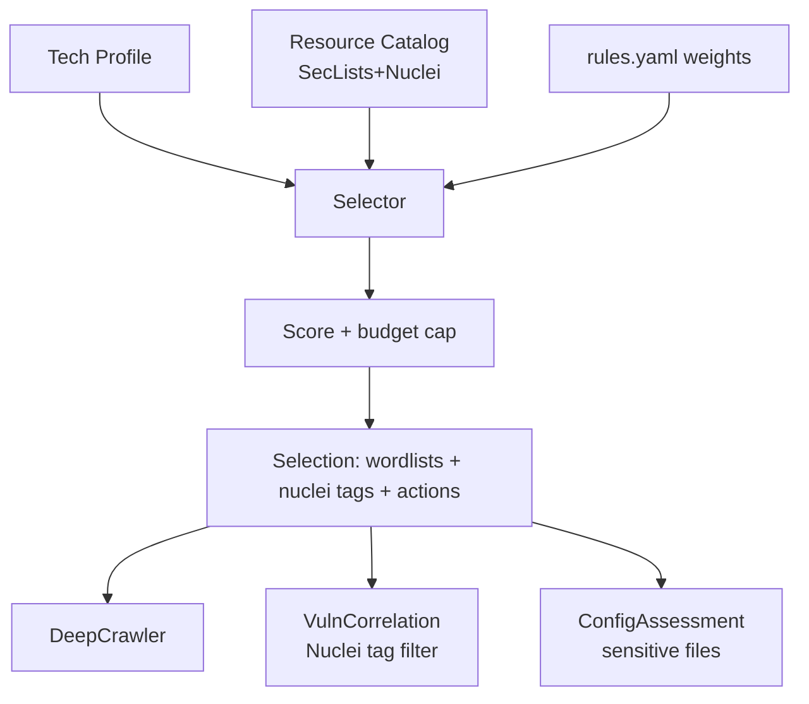
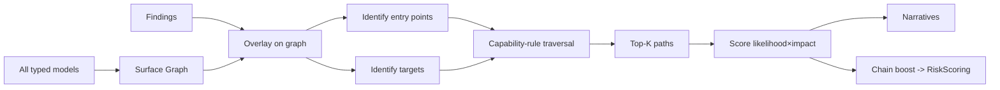
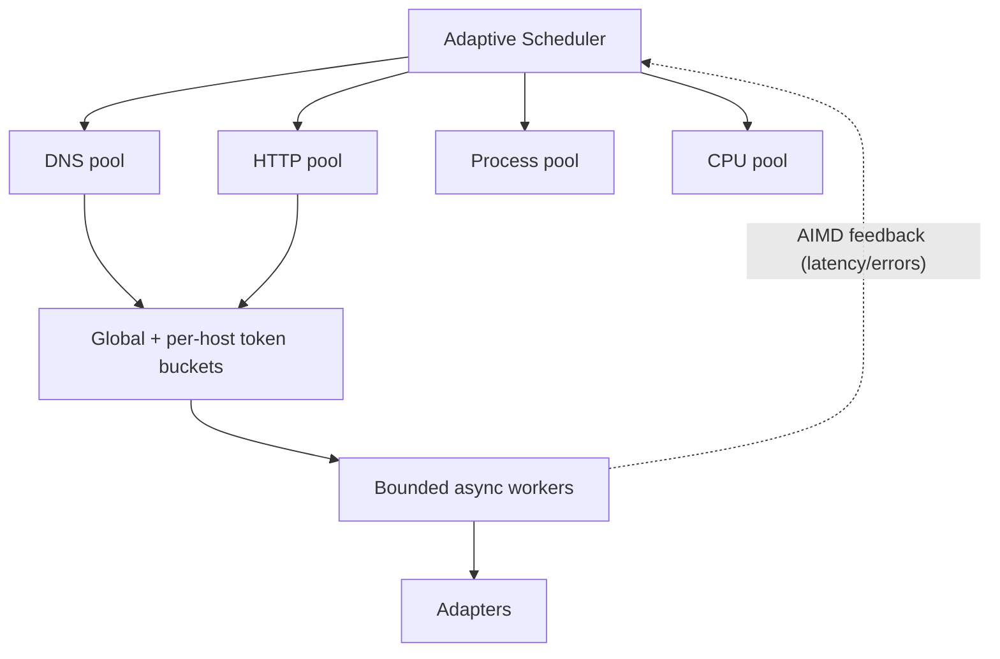
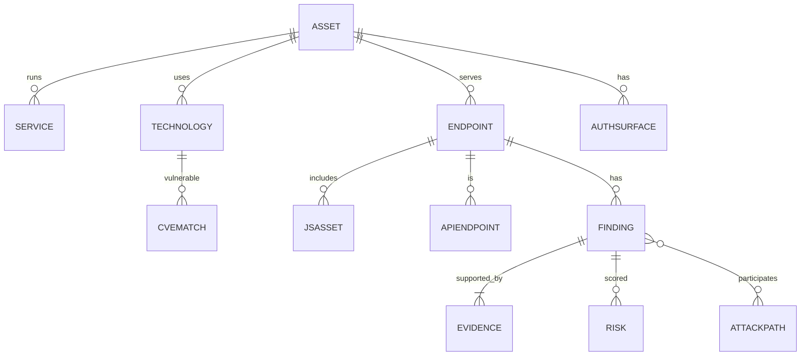

# 10 — Mermaid Diagrams & Execution Flows

## 1. System Context

## 2. Layered Architecture

## 3. Pipeline Stage DAG

## 4. Execution Flow — End to End

## 5. Adapter Reliability Wrapper

## 6. Payload Intelligence Selection Flow

## 7. Attack Path Synthesis

## 8. Concurrency Model

## 9. Data Model Relationships (ER-style)

