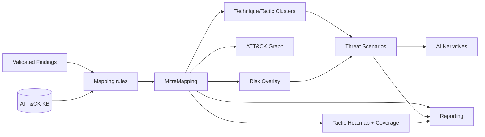
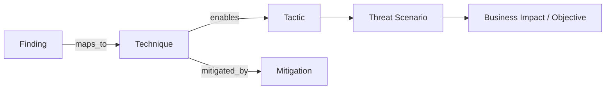

# 14 — MITRE ATT&CK Intelligence Layer

Turns VulnaX-Pro into an **adversary-centric** attack-surface platform: it answers
not just "what vulnerability exists?" but "how would a real attacker use it?".
Built additively — **no existing engine was redesigned**; the layer overlays on
the existing Risk / Attack Path / Graph output.

> Offline-first: ships a curated ATT&CK Enterprise dataset; optionally ingests the
> official STIX bundle if dropped in `mitre/data/enterprise-attack.json`.

---

## 1. Complete MITRE Architecture

```
findings ─┐
          ├─► MitreIntelligenceEngine (stage 14) ─► MitreMapping records
risk ─────┤        │                              ─► ThreatScenario records
paths ────┤        ├─► ATT&CK graph (mitre_graph.json) + Relationship records
graph ────┘        ├─► tactic heatmap + coverage score
                   ├─► ATT&CK risk overlay (attack_risk / business_risk)
                   └─► mitigation intelligence
                            │
                 ctx.store._mitre + stored models
                            │
        ┌───────────────────┼───────────────────┐
   AI Analyst (15)     Reporting (16)        CLI dashboard
   ATT&CK narratives   ATT&CK sections       [MITRE ANALYSIS] block
```

Files: `mitre/` (knowledge base + mapping), `engines/mitre_intelligence.py`,
models `MitreMapping` + `ThreatScenario`.

## 2. MitreIntelligenceEngine Design (stage 14)

Runs after findings, risk, attack paths, and graph are complete; before AI (15) and
reporting (16). Steps: ingest KB → map findings → build ATT&CK graph → heatmap +
coverage → risk overlay → threat scenarios → mitigation aggregation → publish
counters + `ctx.store._mitre`. `depends_on` enforces ordering.

## 3. ATT&CK Knowledge Base Architecture

`mitre/knowledge_base.py` + `mitre/data/attack_core.json`. Normalized models:
**tactics** (14, ordered by kill chain), **techniques/sub-techniques** (34 curated,
each with tactics, criticality, mitigations, description), **mitigations** (M-codes
→ names). `load_kb()` is cached (`lru_cache`); offline by default; `_merge_stix()`
ingests the official STIX bundle if present (update mechanism). Lookups: technique,
tactic, primary_tactic (earliest kill-chain tactic), mitigations_for, ordered_tactics.

## 4. ATT&CK Graph Architecture

Built in the engine as a `networkx.MultiDiGraph`:
`finding ──maps_to──► technique ──enables──► tactic`, plus
`technique ──mitigated_by──► mitigation`. Serialized to
`artifacts/<scan>/mitre_graph.json`; equivalent `Relationship` records are written
to the store so the chain is queryable alongside the main attack-surface graph.

## 5. ATT&CK Correlation Architecture

`mitre/mapping.py` maps each finding → one or more `(technique, confidence,
reasoning)` by category + title keywords + CWE + CVE presence. The engine then
correlates into **technique clusters** (technique → finding count) and **tactic
clusters** (heatmap), and assembles **threat scenarios** (adversary journeys) per
asset by ordering covered tactics along the kill chain.

## 6. ATT&CK Attack-Path Architecture

Threat scenarios are adversary journeys: per asset, one representative technique per
covered tactic is ordered by kill-chain position to form a chain, e.g.

```
Exposed Git Repo (T1213.003, Collection) ─►
Credentials in Files (T1552.001, Credential Access) ─►
Valid Accounts (T1078, Initial Access/Persistence) ─►
Exploit Public-Facing App (T1190) ─►
Data from Cloud Storage (T1530, Collection)
```

Each scenario gets an objective (final tactic), a natural-language narrative, member
findings, and a risk score (max ATT&CK risk along the chain). Existing AttackPath
records are enriched at report time by joining each step's `finding_id` to its
technique mapping (no modification to AttackPathEngine).

## 7. ATT&CK Heatmap Architecture

Per tactic (14 columns in kill-chain order): technique count, finding density, risk
density, max severity. Rendered as a colored grid in HTML (red→orange→amber by risk
density) and as a list in Markdown. **Coverage score** = % of tactics with ≥1
mapping.

## 8. ATT&CK Risk-Scoring Architecture (overlay)

Existing RiskScoring is unchanged. The engine computes an **overlay** per finding:
```
attack_risk   = base_risk*0.6 + max_tactic_weight + technique_criticality*15 + path_bonus
business_risk = attack_risk*0.85 + path_bonus
```
Tactic weights prioritize Initial Access / Credential Access / Privilege Escalation /
Impact; `path_bonus` rewards findings that participate in an attack path. Stored in
`ctx.store._mitre["risk"]` and surfaced in reporting.

## 9. AI ATT&CK Analyst Architecture

AIAnalystEngine (additive) now consumes techniques, tactics, coverage, and the
top threat scenario. The executive summary cites ATT&CK coverage, leading tactics,
and the highest-risk adversary journey, and prioritizes findings enabling high-value
tactics. Provider-agnostic (OpenRouter/DeepSeek/Kimi/Gemini/Anthropic) with offline
fallback; structured evidence only. (Verified: OpenRouter-written summary references
ATT&CK tactics.)

## 10. Reporting Enhancements

New **MITRE ATT&CK Intelligence** section (HTML + Markdown): overview (coverage,
technique/tactic counts, KB version), **tactic heatmap**, **threat scenarios**
(adversary journeys with technique chains), **technique clusters**, and **mitigation
recommendations** (ranked by technique coverage). Each finding shows its mapped
ATT&CK techniques (badges in HTML). New summary cards: ATT&CK Tech, Coverage%.

## 11. CLI Enhancements

New dashboard block (meaningful intelligence only, never raw ATT&CK data):
```
[MITRE ANALYSIS]  Techniques Mapped / Tactics Mapped /
                  Adversary Paths Generated / Threat Scenarios Generated /
                  ATT&CK Coverage %
```

## 12. Data Models

- **MitreMapping** — finding_id, asset_id, technique_id (+sub), technique_name,
  tactic_id/name, confidence, reasoning, mitigations[].
- **ThreatScenario** — title, asset_id, tactic_chain[], technique_ids[],
  finding_ids[], narrative, objective, risk_score.
Both persisted (store collections `mitre_mappings`, `threat_scenarios`) and in the
result bundle + SQLite.

## 13. Mermaid — Layer Flow



## 14. Relationship Diagram



## 15. Implementation Roadmap (status)

| Step | Item | Status |
|------|------|--------|
| 1 | ATT&CK KB (offline, curated) + STIX merge hook | ✅ |
| 2 | Models MitreMapping + ThreatScenario + store | ✅ |
| 3 | Mapping rules (all listed finding types) | ✅ |
| 4 | MitreIntelligenceEngine (map/correlate/graph/heatmap/coverage) | ✅ |
| 5 | ATT&CK risk overlay | ✅ |
| 6 | Threat scenarios (adversary journeys) | ✅ |
| 7 | Mitigation intelligence | ✅ |
| 8 | AI ATT&CK narratives | ✅ |
| 9 | Reporting sections + heatmap + badges | ✅ |
| 10 | CLI [MITRE ANALYSIS] block | ✅ |
| 11 | Pipeline wiring (22 engines) + tests (16) + verified run | ✅ |

### Future
- Full official STIX bundle sync command (`tools update --attack`).
- ATT&CK Groups/Software/Campaigns attribution ("which APTs use these techniques").
- Navigator-layer JSON export for the MITRE ATT&CK Navigator.
- Per-technique detection-engineering guidance (data sources / analytics).
